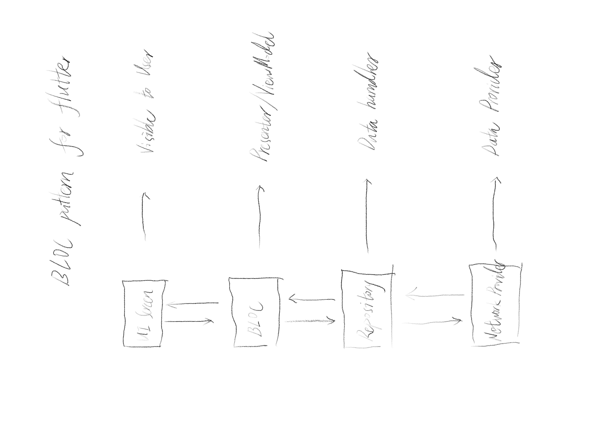
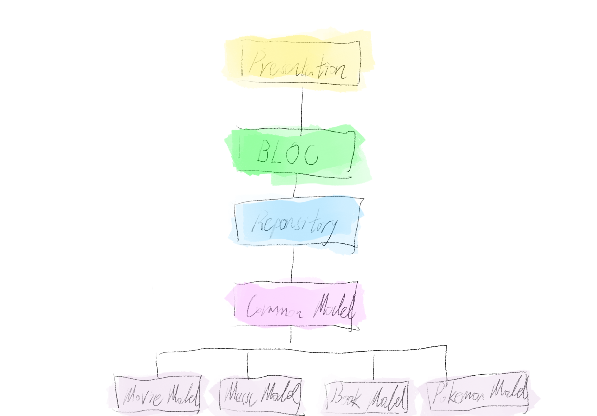

# Media Library
- [Media Library](#media-library)
  - [项目介绍](#项目介绍)
    - [Video](#video)
    - [Music](#music)
    - [Book](#book)
    - [Game](#game)
    - [Pokemon](#pokemon)
  - [Roadmap](#roadmap)
    - [project structure](#project-structure)
    - [Pokemon List Page](#pokemon-list-page)
      - [Card](#card)
      - [Search](#search)
      - [中文](#中文)
    - [Pokemon Detail Page](#pokemon-detail-page)
    - [Custom Theme](#custom-theme)
    - [Mock API](#mock-api)
  - [数据](#数据)
    - [数据获取&JSON自动转换Dart类](#数据获取json自动转换dart类)
      - [包安装](#包安装)
      - [安装Bug](#安装bug)
      - [编写模版类](#编写模版类)
      - [Null Safety](#null-safety)
      - [类代码自动生成](#类代码自动生成)
        - [一次性生成](#一次性生成)
        - [持续生成](#持续生成)
      - [消费自动生成的实体类](#消费自动生成的实体类)
    - [Mock Data](#mock-data)
    - [全局数据管理方案](#全局数据管理方案)
      - [concept](#concept)
      - [struct](#struct)
      - [Bloc](#bloc)
    - [refactor system structure](#refactor-system-structure)
    - [数据初始化&持久化](#数据初始化持久化)
  - [组件](#组件)
    - [剑气加载动画](#剑气加载动画)
    - [瀑布流列表(Infinite List)](#瀑布流列表infinite-list)
      - [组件候选](#组件候选)
  - [Route](#route)
    - [V1 `Main App - Child App`](#v1-main-app---child-app)
      - [主路由配置](#主路由配置)
      - [子路由配置](#子路由配置)
    - [V2 `Nest Route`](#v2-nest-route)
  - [性能优化](#性能优化)
  - [Bug](#bug)
  - [参考](#参考)

## 项目介绍
favor media collection
### Video
- API source  
[the movie db](https://www.themoviedb.org/documentation/api?language=en-US)
### Music
- API source  
youtube music

### Book
- API source  
google book
### Game
- API source  
[RAWG](https://rawg.io/apidocs)
### Pokemon
- API source  
[PokeAPI](https://pokeapi.co)

## Roadmap

### project structure
- [x] route
- [x] 子app管理自身路由(模仿flutter gallery路由管理)
### Pokemon List Page
#### Card
- [x] picture
- [x] layout
- [x] type
- [x] icon
- [x] font

#### Search
- [x] search
- [ ] filter
  实现方案 
  - expanedList? ✖️
  - [x] container + visible  ✔️
  - [ ] 对接后台 
#### 中文

pokemon api支持多语言
> 部分信息不支持
- [x] 语言更换为中文

### Pokemon Detail Page
- [x] detail page widget
- [ ] model
- [ ] data fetch

### Custom Theme
- [x] 抽取样式
### Mock API
- [x] dio interceptor 实现

## 数据
### 数据获取&JSON自动转换Dart类
使用`json_serializable`转换第三方API提供的口袋妖怪JSON数据

#### 包安装

```
dependencies:
  # Your other regular dependencies here
  json_annotation: <latest_version>

dev_dependencies:
  # Your other dev_dependencies here
  build_runner: <latest_version>
  json_serializable: <latest_version>

```

#### 安装Bug
- 包安装时按照官方的介绍报错
json_annotation的版本太高导致，换为较低包版本编译通过 
```
dependencies:
  flutter:
    sdk: flutter
  json_annotation: 4.0.1
  http: 0.13.0

dev_dependencies:
  build_runner: ^1.11.5

  # Used by tests. Not required to use `json_serializable`.
  build_verify: ^2.0.0

  json_serializable: 4.1.3
```

#### 编写模版类
根据口袋妖怪API编写模版类
```dart
import 'package:json_annotation/json_annotation.dart';

/// This allows the `User` class to access private members in
/// the generated file. The value for this is *.g.dart, where
/// the star denotes the source file name.
part 'Pokemon.g.dart';

@JsonSerializable()
class Pokemon {
  final int id;
  final String num;
  final String name;
  final String img;
  final List<String> type;
  ...

  Pokemon(
    this.id,
    this.num,
    this.name,
    this.img,
    this.type,
    ...
  );

  factory Pokemon.fromJson(Map<String, dynamic> json) =>
      _$PokemonFromJson(json);

  Map<String, dynamic> toJson() => _$PokemonToJson(this);
}

```

#### Null Safety
由于Dart在2.12环境以上支持并默认开启Null Safety特性，因此在类编写时可能为空的属性时声明需要修改。
```dart
final int? id;
final String? num;
final String? name;
```
修改为
```dart
final int id;
final String num;
final String name;
```

#### 类代码自动生成
##### 一次性生成
根目录运行命令即可自动生成
```
flutter pub run build_runner build
```
##### 持续生成
开启一个`watcher`监视项目文件并自动编译我们需要的文件
```
 flutter pub run build_runner watch
```

#### 消费自动生成的实体类
```dart
List<Pokemon> parseData(response) {
  final parsed = jsonDecode(response)['pokemon'];
  final pokemonList = parsed.map<Pokemon>((json) => Pokemon.fromJson(json)).toList();
  return pokemonList;
}
```

### Mock Data

### 全局数据管理方案
- Bloc
- Redux
- Fish Redux

#### concept
Redux 通过globle store全局管理，提倡immutible和pure function。
Bloc 通过通知与订阅更新数据量流，可以同时拥有多个不同Bloc数据流。


#### struct
Redux
需要创建reducer events actions，并构建它们的对应关系

Bloc
- Presentation
- Business Logic
- Data
  - Repository
  - Data Provider

#### Bloc 


Architecture
- data layer
- domain layer
- feature layer
  - presentation/UI (widgets)
  - business logic (blocs/cubits)

- Library
  - Repository 
    - cache 数据缓存
    - equatable
      > Note: We extend Equatable so that we can compare instances of GithubSearchEvent. By default, the equality operator returns true if and only if this and other are the same instance. 

Dart Class
- Extend
- Mixin

Abstract Bloc
- bloc 1
- bloc 2
- bloc 3

package: [get it](https://pub.dev/packages/get_it)

### refactor system structure 


### 数据初始化&持久化
- share_preference 
- path_provider
- sqllite
- hive

## 组件
### 剑气加载动画
实现参考 [Flutter实现"剑气"加载](https://juejin.cn/post/7002977635206692901)

### 瀑布流列表(Infinite List)
#### 组件候选
- 官方
  - ListView
  - GridView 
- 社区
  - [flutter_staggered_grid_view](https://github.com/letsar/flutter_staggered_grid_view)
  - [waterfall_flow](https://github.com/fluttercandies/waterfall_flow)

> 参考：[一套 Flutter 混排瀑布流解决方案](https://www.infoq.cn/article/gwhc3cdseq8ixb5hi2lo)
## Route
-  route
   -  flutter route 1.0
  
  - 匿名route
  - 指定route
  - onGenerateRoute

- flutter route 2.0
  - page
  - route
  - route delegate

### V1 `Main App - Child App`
采用谷歌官方Gallary Demo的路由构建方式，将app分为主app与子app，主app负责根据路由build不同子app，子app自行管理其路由页面。  

#### 主路由配置

```dart

class RouteConfiguration {
  static List<Path> paths = [
    // pokemon
    Path(
      r'^' + pokemon_routes.listRoute,
      (context, match) => ChildAppWrapper(childApp: pokemon_app.PokemonApp()),
    ),
    // video
    Path(
      r'^' + video_routes.listRoute,
      (context, match) => ChildAppWrapper(
          childApp: video_app.VideoApp(
        defaultRoute: match,
      )),
    ),
    // book
    Path(
      r'^' + book_routes.listRoute,
      (context, match) => ChildAppWrapper(childApp: book_app.BookApp()),
    ),
    // music
    Path(
      r'^' + music_routes.listRoute,
      (context, match) => ChildAppWrapper(childApp: music_app.MusicApp()),
    ),
    // home
    Path(r'^/', (context, match) => NavigatePage()),
  ];

  static Route<dynamic> onGenerateRoute(RouteSettings settings) {
    final String name = settings.name!;
    for (final path in paths) {
      final regExpPattern = RegExp(path.pattern);
      if (regExpPattern.hasMatch(name)) {
        // final firstMatch = regExpPattern.firstMatch(name);
        // final match =
        //     (firstMatch?.groupCount == 1) ? firstMatch?.group(1) : null;

        return MaterialPageRoute<void>(
          builder: (context) => path.builder(context, settings),
          settings: settings,
        );
      }
    }

    return MaterialPageRoute(
      builder: (BuildContext context) => Scaffold(
        body: Center(
          child: Text('路径错误'),
        ),
      ),
    );
  }
}

```

#### 子路由配置
```dart

```

然而如此实现在应用中有如下问题：
- 主路由难以直接跳转至子路由的某个页面（如详情页面）
- 滑动返回操作会退出至主路由，而不是子路由的历史上级

因此将路由改为嵌套路由`Nest Route`

### V2 `Nest Route`


## 性能优化
- cached_network_image `网络缓存图片`
## Bug

- [x] 图片加载后调试闪退
- [x] When building Flutter applications, you may run into the following error:
Vertical viewport was given unbounded height

column 内有gridview控件，需要放入`expand`内


- [ ] 后退滑动直接回主页面

- [x] epub包需要的realm依赖安装时间很长，需等待

## 参考
- [Flutter官网](https://flutter.dev/docs/development/data-and-backend/json)