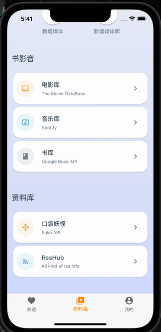

# Media Library
A flutter demo of favor media library collection, use BLOC pattern and layer project structure. use [MediaLibraryBackend](https://github.com/SunsetFrost/MediaLibraryBackend) build with nestjs.

- movie 


-  music | book 


- pokemon | rss  




## Install
- require flutter

```bash
git clone
flutter pub get
flutter run
```